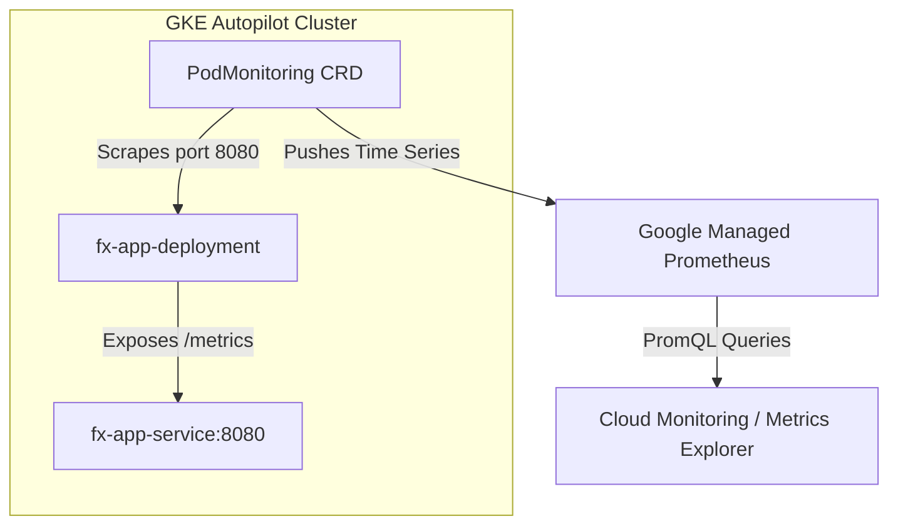

# gke-fx-prometheus-stack

Production-ready observability stack for a simulated FX trading system deployed on Google Kubernetes Engine (GKE) Autopilot, monitored using Google Managed Service for Prometheus (GMP) and Google Cloud Monitoring Metrics Explorer.

---

## 🏗️ Architecture

🔍 Metric Analysis in Google Cloud Metrics ExplorerNavigate to Google Cloud Console $\rightarrow$ Monitoring $\rightarrow$ Metrics Explorer.Click the < / > PromQL button to switch to code mode.Set the time range selector to 10m or 30m.

Query 1: Total FX Trade Volume Rate (Filled vs. Rejected)Calculate the per-second rate of FX orders categorized by order status:

sum(rate(fx_orders_total[1m])) by (status)

Query 2: p99 FX Order Execution LatencyCalculate the 99th percentile (p99) trade execution latency across all running pods:

histogram_quantile(0.99, sum(rate(fx_order_execution_latency_seconds_bucket[1m])) by (le))

Example Result: 0.247 $\rightarrow$ 99% of FX orders were executed within 247 milliseconds, with only 1% taking longer.

PromQL Latency Query
To query the 99th percentile (p99) trade execution latency in Cloud Monitoring Metrics Explorer:
histogram_quantile(0.99, sum(rate(fx_order_execution_latency_seconds_bucket[1m])) by (le))

🚀 Getting Started

Prerequisites

Google Cloud SDK (gcloud) installed and configured.

kubectl CLI installed.

Docker & GCP Artifact Registry access.

1. Provision Cluster & Push Container

   # Create GKE Autopilot Cluster
gcloud container clusters create-auto fx-trading-cluster \
    --region=asia-southeast1

# Create Artifact Registry Repository
gcloud artifacts repositories create fx-repo \
    --repository-format=docker \
    --location=asia-southeast1

# Authenticate Docker to GCP
gcloud auth configure-docker asia-southeast1-docker.pkg.dev

2. Deploy Application & PodMonitoring
   
Bash

# Apply deployment, service, and PodMonitoring CRD
kubectl apply -f deployment.yaml

# Verify pod status
kubectl get pods -l app=fx-execution-service

🧹 Cleanup
To avoid ongoing Google Cloud resource charges:

Bash
# Delete Kubernetes resources
kubectl delete -f deployment.yaml

# Delete GKE Autopilot Cluster
gcloud container clusters delete fx-trading-cluster \
    --region=asia-southeast1 --quiet

# Delete Artifact Registry Repository
gcloud artifacts repositories delete fx-repo \
    --location=asia-southeast1 --quiet

